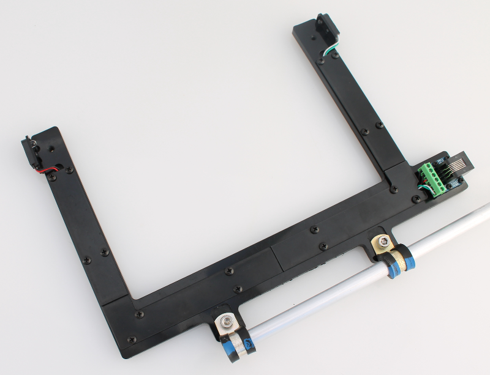

Making a photogate
==============================

The photogate kit includes two pre-assembled photogates. The photogate assembly steps below are only included for informational purposes and for users intending to make their own DIY photogates.  

   
1) Photogate rod
----------------------------------------------
Use the 2 x loop clamps and 2 x 10-32 scews to attach the rod as shown in the images. Requires a hex wrench. (Parts # 1, 2 and 3 in :ref:`hardware_label`).

.. figure:: _static/assembly_2.png
   :align:  center

   
2) Gravitech RJ11 breakout board
----------------------------------------------
Use the four 2-56 screws to mount the RJ11 breakout board to the photogate body. (Parts # 9, 10).   

.. figure:: _static/assembly_5.png
   :align:  center

3) Laser cut sensor/led mounts
----------------------------------------------
Use the 5/16" long 4-40 screws to attach the sensor/led mounts to the sides of the photogate. Orient the parts with the larger hole towards the top. (Parts # 4, 5).

.. figure:: _static/assembly_6.png
   :align:  center

4) Photogate sensor/led 
----------------------------------------------
Press-fit the LED and Sensor into the mounts. (Part # 8).

.. figure:: _static/assembly_7_8.png
   :align:  center

   
5) Cable covers
----------------------------------------------
Use the 1/4" 4-40 screws to mount three of the cable covers. (Parts # 6, 7).

   
6) Wiring to the RJ11 breakout board
----------------------------------------------
Cut and strip the four wires. 

.. figure:: _static/assembly_10.png
   :align:  center
   
Using a small Philips blade screwdriver. insert and secure wires into the RJ11 breakout board as shown in the image below. 

* Phototransistor wires first (white, green) followed by emitter LED wires (black, red). 

Using some of the left-over black wire from the LED component, form a small u-shaped loop and place the ends into the last two terminal blocks. This is for the auto-detect function.

7) Finished photogate
----------------------------------------------
Screw on the last cable cover to finish assembly.

