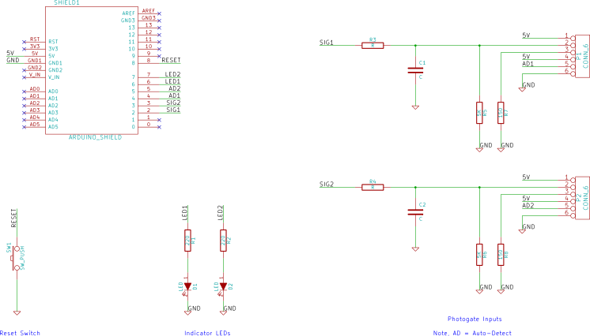

Photogate shield for Arduino
================================

KiCad design files and Gerber files for the PCB can be downloaded from the project page at https://bitbucket.org/iorodeo/photogate_shield. 

Shield Images
--------------------

   

Shield BOM
------------------
   

=========  =====  =========================================   ==================   ==================         
Ref        Qty    Description                                 Vendor               Part #
=========  =====  =========================================   ==================   ==================         
-          1      Photogate shield board v1.1                  IO Rodeo             
D1,2       2      Red LED                                      Jameco               202471
P1,2       2      RJ11 jack                                    Digikey              A31406-ND
SW1        1      Reset button                                 Digikey              P8006S-ND
R1,2       2      220 Ohm resistor, 1/8W                       Digikey              CF18JT220RCT-ND
R3,4,5,6   4      5.6 K Ohm resistor, 1/8W                     Digikey              CF18JT5K60CT-ND
R7, R8     2      150 Ohm resistor, 1/8W                       Digikey              CF18JT150RCT-ND
-          1      Breakaway header, 40pos                      Digikey              A32701-40-ND
=========  =====  =========================================   ==================   ==================         
 

.. _firmware_label:

Programming Arduino with photogate firmware
------------------------------------------------------
**Note: If you received a pre-programmed Arduino with your photogate kit you can skip this section.**

To build the photogate firmware you will also need the Arduino Streaming library [#f1]_.

* Download the Arduino photogate firmware from https://bitbucket.org/iorodeo/photogate_software/get/default.zip
* Unzip the .zip archive. The firmware is located in the firmware subfolder
* Connect your Arduino board. Launch the Arduino IDE  [#f2]_ and open the main firmware file “firmware.ino”  
* Select the Arduino Uno board model
* Select the serial port it is using -- under “Tools” menu of the Arduino IDE
* Upload the photogate firmware to the Arduino board.

.. rubric:: Footnotes

.. [#f1] Arduino streaming library download: http://arduiniana.org/libraries/streaming/. Instructions for installing Arduino libraries can be found here: http://arduino.cc/en/Guide/Libraries
.. [#f2] Arduino IDE installation instructions available at http://arduino.cc/en/Guide/HomePage. More detailed instructions for using the Arduino IDE can be found at `<http://arduino.cc/en/Guide/Environment>`_

