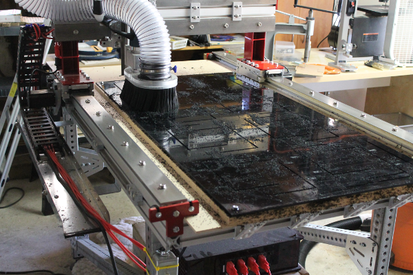
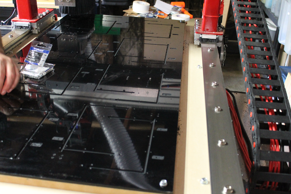
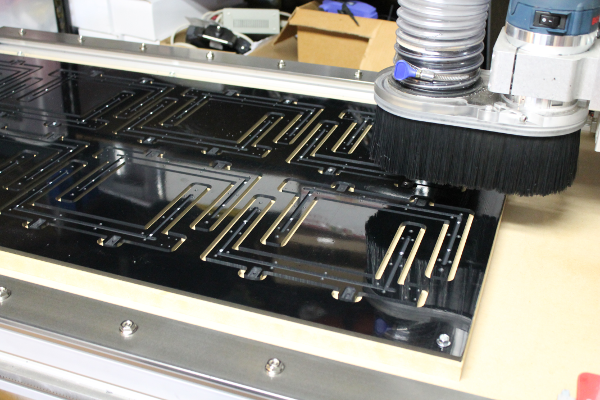
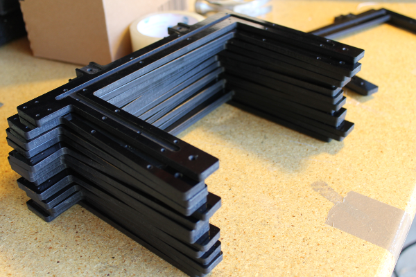

Machining the photogate on CNC Router
======================================

Photogates were machined on a CNC router from a sheet of 2' x 4' x 0.25" ABS. The drawings (DXF), gcode generation (`py2gcode <https://bitbucket.org/iorodeo/py2gcode>`_) and gcode for manufacturing the designs are available here: https://bitbucket.org/iorodeo/photogates.
Below are some images of the manufacturing process.

.. figure:: _static/router_1.png
   :align:  center
.. figure:: _static/router_2.png
   :align:  center

.. figure:: _static/router_4.png
   :align:  center

.. figure:: _static/router_8.png
   :align:  center
.. figure:: _static/router_9.png
   :align:  center

.. figure:: _static/router_12.png
   :align:  center
.. figure:: _static/router_13.png
   :align:  center

